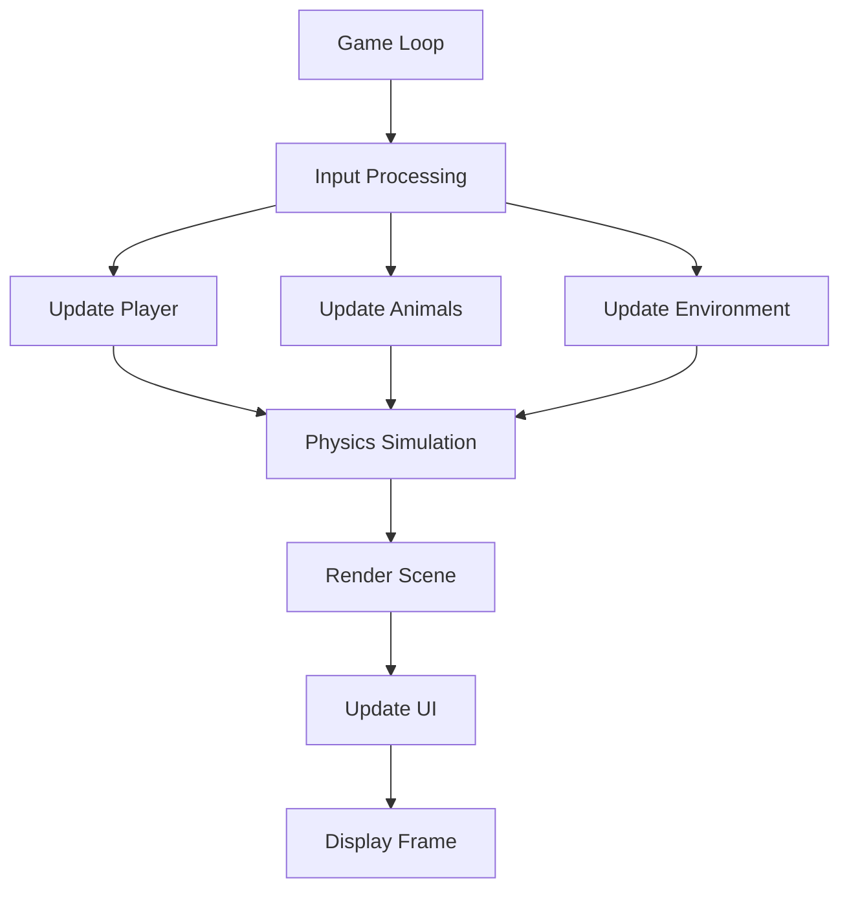

# 3D Hunting Simulator Game Design Document

## 1. Introduction
This document outlines the architecture and specifications for a 3D hunting simulator game developed in Python. The game will simulate realistic hunting experiences with features such as player movement, aiming, shooting, animal behavior, terrain generation, and a user interface. The design emphasizes modularity to facilitate easy implementation and future extensions.

## 2. Library Selection
After research, the following Python libraries are recommended:
- **Panda3D**: A powerful 3D game engine with robust rendering, physics, and animation capabilities. Suitable for complex 3D simulations.
- **Ursina**: A simpler, beginner-friendly 3D engine built on top of Panda3D, ideal for rapid prototyping and easier learning curve.
- **Additional Libraries**:
  - **NumPy**: For mathematical computations in terrain generation and physics.
  - **Pygame**: For 2D UI elements and input handling if needed.
  - **OpenSimplex**: For procedural terrain generation.

**Selected Primary Library**: Panda3D for its comprehensive features and performance in 3D simulations.

## 3. Key Features and Mechanics

### 3.1 Player Mechanics
- **Movement**: First-person movement with walking, running, crouching, and jumping. Include stamina system affecting speed.
- **Aiming**: Mouse-based camera control with zoom functionality for scoped weapons.
- **Shooting**: Realistic ballistics with bullet drop, wind effects, and accuracy based on weapon type and player stability.
- **Inventory**: Management of weapons, ammunition, and gear.

### 3.2 Animal Behavior
- **AI System**: Animals with states (idle, foraging, fleeing, alerted). Use finite state machines for behavior.
- **Detection**: Animals detect players based on sound, sight, and smell with configurable ranges.
- **Movement**: Realistic animal locomotion with pathfinding around obstacles.

### 3.3 Terrain Generation
- **Procedural Generation**: Use noise functions to create varied landscapes with hills, forests, and water bodies.
- **Biomes**: Different environments affecting animal spawns and player movement (e.g., dense forest vs. open field).

### 3.4 User Interface
- **HUD**: Display health, ammunition, mini-map, and objectives.
- **Menus**: Main menu, pause menu, inventory screen, and settings.
- **Feedback**: Visual and audio cues for hits, misses, and environmental interactions.

## 4. High-Level Architecture

### 4.1 Modules
- **core**: Main game loop, initialization, and configuration.
- **player**: Player character, controls, and inventory.
- **animals**: Animal AI, behavior, and spawning.
- **environment**: Terrain generation, weather, and environmental effects.
- **ui**: User interface elements and menus.
- **physics**: Collision detection, ballistics, and physics simulations.
- **audio**: Sound management and audio effects.
- **utils**: Helper functions and utilities.

### 4.2 Classes
- **Game**: Main game class managing the game loop and state.
- **Player**: Handles player movement, aiming, shooting, and inventory.
- **Animal**: Base class for animals with subclasses for different species.
- **Terrain**: Manages terrain generation and rendering.
- **Camera**: Controls camera movement and perspective.
- **Weapon**: Represents different weapons with properties like damage, range, and fire rate.
- **UIElement**: Base class for UI components.

### 4.3 Data Flow

## 5. Detailed Specifications

### 5.1 Player Module
- **Player Class**:
  - Attributes: position, velocity, health, stamina, inventory
  - Methods: move(), aim(), shoot(), update()
- **Controls**: WASD for movement, mouse for aiming, left-click to shoot, space to jump, C to crouch.

### 5.2 Animals Module
- **Animal Class**:
  - Attributes: position, state, health, species
  - Methods: detect_player(), move(), react(), update()
- **Species Subclasses**: Deer, Rabbit, etc., with specific behaviors and stats.

### 5.3 Environment Module
- **Terrain Class**:
  - Methods: generate_terrain(), get_height(), render()
- **Weather System**: Dynamic weather affecting visibility and animal behavior.

### 5.4 UI Module
- **Menu Classes**: MainMenu, PauseMenu, InventoryMenu
- **HUD Class**: Displays real-time information.

### 5.5 Physics Module
- **Ballistics**: Calculate bullet trajectory with gravity and wind.
- **Collision**: Detect hits on animals and environment.

## 6. Modularity and Extensibility
- Each module is self-contained with clear interfaces.
- Use dependency injection for easy testing and replacement of components.
- Configuration files for game settings, allowing easy modification without code changes.

## 7. Implementation Plan
1. Set up project structure and dependencies.
2. Implement core game loop and basic rendering.
3. Develop player mechanics.
4. Add animal AI and behavior.
5. Implement terrain generation.
6. Create UI elements.
7. Integrate physics and audio.
8. Test and optimize.

## 8. Conclusion
This design provides a solid foundation for a 3D hunting simulator with modular architecture supporting easy development and future enhancements. The use of Panda3D ensures high-quality 3D rendering and performance.